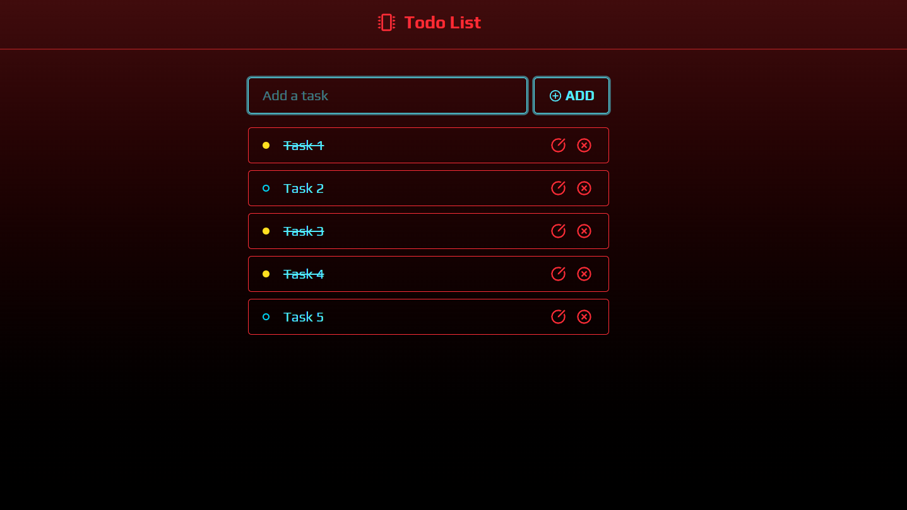

# 📝 React Todo List

A cyberpunk-style Todo List built with **React**, **TypeScript**, **Tailwind CSS**, and **localStorage**.  
This project allows users to add, edit, mark as complete, and delete tasks — with data persisting even after refreshing the page.



## 🚀 Demo
🔗 [Live Website](https://react-todo-list-khaki-rho.vercel.app/)

## 🛠️ Features
- Add new tasks
- Edit existing tasks
- Mark tasks as completed
- Delete tasks
- Cyberpunk-style UI with icons
- Data persistence using `localStorage`
- Keyboard shortcuts (e.g. press `Enter` to add or save)

## 📦 Tech Stack
- React + TypeScript
- Tailwind CSS
- React Icons
- Vite

## 🔧 Getting Started

Clone the repository and run the app locally:

```bash
git clone https://github.com/Patipat003/react-todo-list
cd react-todo-list
npm install
npm run dev
